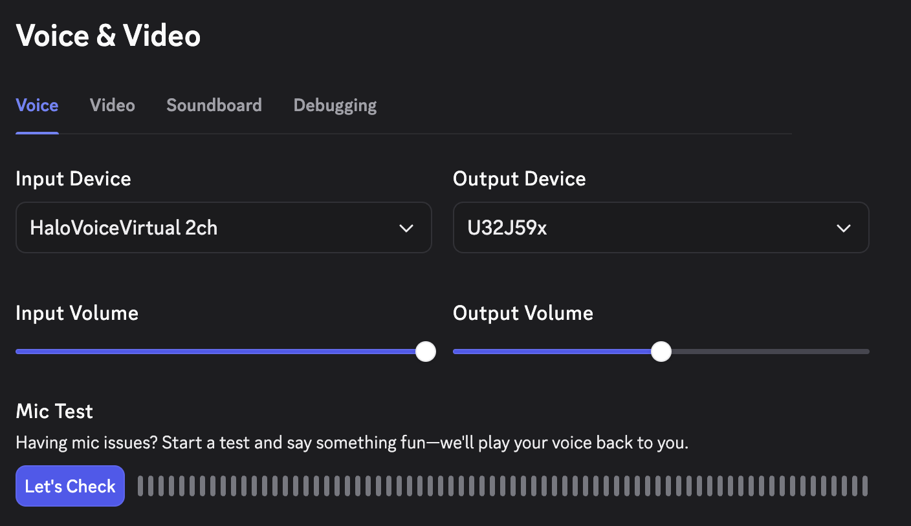
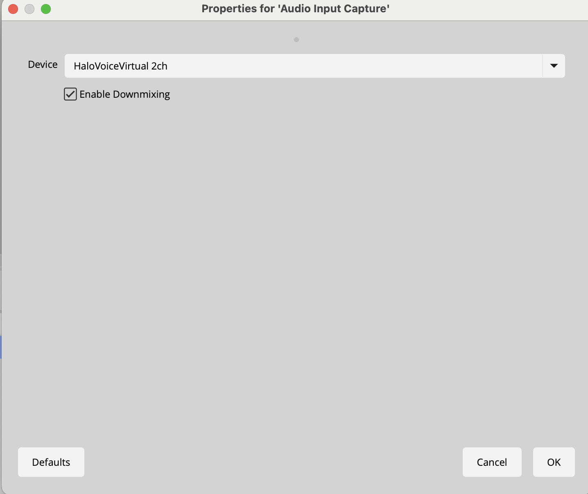

  
  
  # HaloVoice 🎙️
  
  **Real-time voice translation for streaming, gaming, and meetings**
  
  Break language barriers instantly with one-click translation
  
  
  

---

## ✨ Features

- 🌍 **Real-time Translation** - Translate your voice instantly with minimal latency
- 🔌 **Works Everywhere** - Compatible with Discord, OBS, Teams, Zoom, Google Meet, and more
- 🎤 **Virtual Audio Device** - Creates a virtual microphone that outputs translated audio
- 📝 **Live Captions** - Display translated text in real-time
- ⚡ **Low CPU Usage** - Optimized for long streaming/gaming sessions
- 🗣️ **Multiple Languages** - Support for 50+ languages worldwide

## 🚀 Quick Start

1. **Download** the latest version from [Releases](https://github.com/Monkiia/HaloVoice/releases/latest)
2. **Install** by opening the `.pkg` file (macOS)
3. **Launch** HaloVoice from Applications
4. **Select** your source and target languages
5. **Start** translating!

## 📖 How to Use

### 🎮 With Discord

1. Open **Discord Settings** → **Voice & Video**
2. Select **"HaloVoice Virtual Microphone"** as Input Device
3. Your voice will be translated in real-time for all your gaming sessions
4. Perfect for international gaming teams and communities

### 📹 With OBS Studio

1. Open **OBS Studio**
2. Add **Audio Input Capture** source
3. Select **"HaloVoice Virtual Microphone"**
4. Your translated voice will be streamed to your audience
5. Great for reaching international viewers on Twitch/YouTube

### 💼 With Teams/Zoom/Google Meet
1. Open your meeting app **Settings**
2. Navigate to **Audio** settings
3. Select **"HaloVoice Virtual Microphone"** as your microphone
4. Speak in your language, participants hear the translation
5. Break language barriers in business meetings instantly

## 💻 System Requirements

### macOS
- macOS 10.15 (Catalina) or later
- Apple Silicon (M1/M2/M3) or Intel processor
- 4GB RAM minimum (8GB recommended)
- Internet connection for translation services

### Windows (Coming Soon)
- Windows 10/11
- 4GB RAM minimum
- Internet connection required

## 🎯 Perfect For

- 📺 **Live Streaming** - Reach global audience on Twitch/YouTube
- 🎮 **Gaming** - Communicate with international teammates
- 💼 **Online Meetings** - Break language barriers in business calls
- 📚 **Education** - Teach or learn across languages
- 🎬 **Content Creation** - Create multilingual content easily

## ⚙️ Configuration

### Language Settings
- Source Language: Auto-detect or select specific language
- Target Language: Choose from 50+ languages
- Voice Settings: Adjust voice speed and pitch

### Audio Settings
- Input Device: Select your microphone
- Output Device: Configure virtual audio output
- Volume Control: Adjust translation volume

## 🔧 Troubleshooting

### No Audio Output?
1. Check if HaloVoice Virtual Microphone is installed
2. Grant microphone permissions in System Preferences
3. Restart the application

### Translation Not Working?
1. Check internet connection
2. Verify language settings
3. Ensure microphone is working properly

### High Latency?
1. Close unnecessary applications
2. Check internet speed
3. Try selecting a closer server region

## 💰 Pricing

| Plan | Price | Features |
|------|-------|----------|
| **Free Trial** | $0 | • 60 minutes daily • All languages • Full features |
| **Pro** | $9.9/month | • Unlimited translation • Priority support • Early access to new features |

  
  [🚀 Subscribe to Pro](https://buy.stripe.com/14A3cwgyAgiMgan4EIgMw01)
  

## 📝 Privacy

- Audio is processed securely
- No recordings are stored
- GDPR compliant
- See our [Privacy Policy](https://halovoice.app/#privacy)

## 🤝 Support

- Email: support@halovoice.app
- [Report Issues](https://github.com/Monkiia/HaloVoice/issues)
- [Documentation](https://halovoice.app)

## 📜 License

Copyright © 2025 HaloVoice. All rights reserved.

---

  
  **Made with ❤️ for creators, educators, and remote teams worldwide**
  
  
  
  
  

