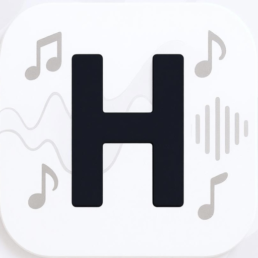
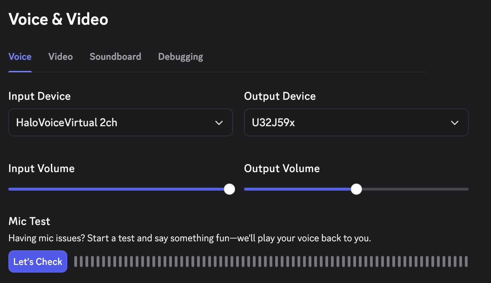
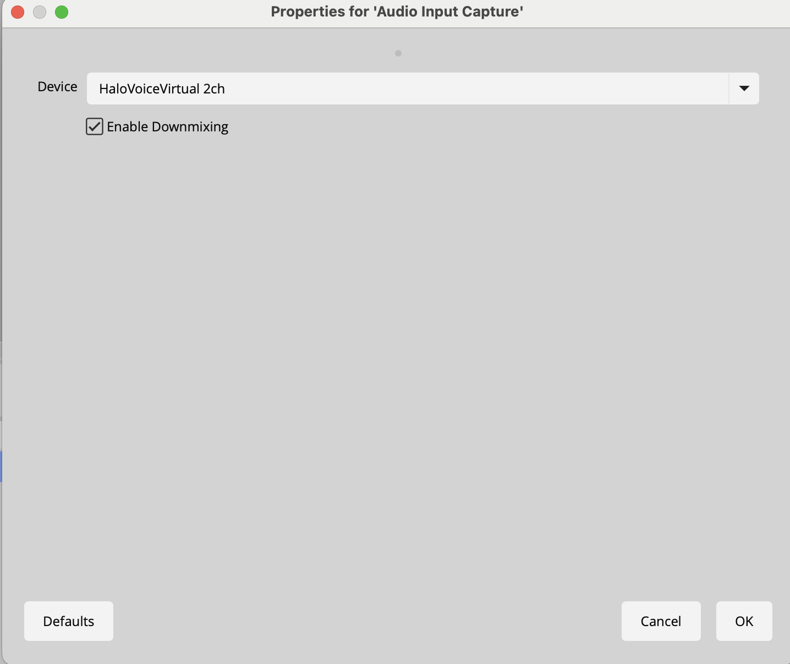
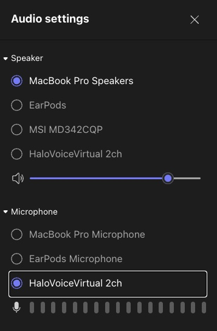
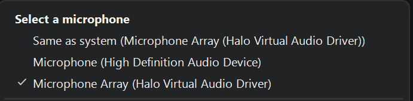

  

  # HaloVoice

  **Real-time AI Voice Translation for Streaming, Gaming, and Meetings**

  Translate your voice in real-time across 30+ languages. Works with OBS, Discord, Zoom, Teams, and more.

  
  

---

## ✨ What's New

- **Two-Way Translation with Voice Playback** - Translation now works in both directions. *Understand what others say* turns the other side's speech into live subtitles in your language — or lets you **hear it spoken aloud in your language** (Pro), so you can stay focused on the game or meeting instead of reading.
- **Three Optimized Modes** - Pick your scenario and HaloVoice tunes itself:
  - **Gaming Mode** - lowest latency with minimal impact on system resources
  - **Streaming Mode** - studio-grade audio processing and enhanced voice clarity for live broadcasts
  - **Meeting Mode** - balanced audio with enhanced noise suppression for professional calls
- **Movable Subtitle Overlay** - A floating, draggable subtitle bar (desktop app) that stays on top of your game, stream, or meeting — position live translations anywhere on screen.
- **AI Precision Control** - Choose your own balance between translation speed and accuracy in Settings.
- **Refer & Earn** - Invite friends and you both get 7 days of unlimited premium voices.

## Features

- **Real-time AI Translation** - Translate your voice instantly across 30+ languages with under 200ms latency
- **Two-Way Translation** - Your voice is translated for others, and their speech is translated back to you as subtitles or spoken audio
- **Scenario Modes** - Gaming, Streaming, and Meeting modes, each optimized for its environment
- **Voice Mod** - Change your voice style without changing your language
- **Voice Studio** - Browse premium voices or create custom voice clones
- **Crystal Clear Audio** - Advanced noise cancellation for professional sound quality
- **Live Captions & Movable Overlay** - Real-time transcription and translated text, with a draggable on-top subtitle overlay in the desktop app
- **Works Everywhere** - Plug-and-play with OBS, Discord, Zoom, Teams, Slack, Google Meet, TikTok, and Steam
- **Lightweight** - All processing happens in the cloud, keeping your CPU free
- **30+ Languages** - English, Spanish, French, German, Japanese, Korean, Mandarin, and many more

## Quick Start

1. **Open** [console.halovoice.app](https://console.halovoice.app) in your browser
2. **Sign in** with Google or Email
3. **Select** your source and target languages
4. **Click "START SESSION"** and start speaking

> For seamless integration with apps like Discord, OBS, and Zoom, you can optionally install the virtual audio driver from within the app.

## Integrations

HaloVoice works directly in your browser. To use your translated voice in other apps, install the optional virtual audio driver and select it as your microphone input.

### With Discord

1. Open **Discord Settings** > **Voice & Video**
2. Select **HaloVoice Virtual Microphone** as your Input Device
3. Your voice is translated in real-time for all your gaming sessions

### With OBS Studio

1. In **OBS Studio**, add an **Audio Input Capture** source
2. Select **HaloVoice Virtual Microphone**
3. Your translated voice streams directly to your audience on Twitch, YouTube, or TikTok

### With Teams / Zoom / Google Meet
**Teams Mic Setup**
**Zoom Mic Setup**

1. Open your meeting app's **Audio** settings
2. Select **HaloVoice Virtual Microphone** as your microphone
3. Speak in your language, participants hear the translation instantly

Also works with **Slack**, **Google Meet**, and any app that accepts a microphone input.

## Perfect For

- **Live Streaming** - Reach global audiences on Twitch, YouTube, and TikTok in their language
- **Gaming** - Communicate with international teammates on Steam, Discord, and more
- **Online Meetings** - Break language barriers on Zoom, Teams, Google Meet, and Slack

## Pricing

| Plan | Price | Features |
|------|-------|----------|
| **Free** | $0 | 60 minutes/month, live captions & translation, works with OBS/Zoom/Discord |
| **Pro** | $9.9/month | Unlimited translation, all languages, priority processing, premium voices, custom voice cloning, early access to new features |
| **Enterprise** | Custom | Dedicated server, API access, SLA, 24/7 support, SSO integration |

  [Get Started Free](https://console.halovoice.app)

## Privacy

- Audio is processed securely
- No recordings are stored
- GDPR compliant
- See our [Privacy Policy](https://halovoice.app/#privacy)

## Support

- Email: support@halovoice.app
- [Report Issues](https://github.com/Monkiia/HaloVoice/issues)
- [Website](https://halovoice.app)

## License

Copyright 2026 HaloVoice. All rights reserved.

---

  **Made for creators, gamers, and remote teams worldwide**

  
  
  

